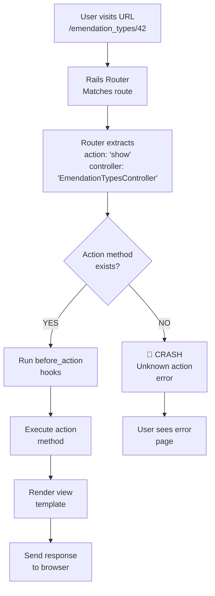

# Unknown Action 'show' Error — Detailed Explanation

**Error Message:**
```
Unknown action
The action 'show' could not be found for EmendationRulesController
```

**URL Attempted:**
```
http://localhost:3000/emendation_types/index
```

---

## Table of Contents
1. [What Went Wrong (Plain English)](#what-went-wrong)
2. [How Rails Routing Works](#rails-routing-basics)
3. [The Root Cause](#root-cause)
4. [Why You See EmendationRulesController in the Error](#why-different-controller)
5. [How to Fix This](#solutions)
6. [Anatomy of the Problem (Detailed)](#anatomy)

---

## What Went Wrong

In plain English, here's what happened:

1. **You tried to access a URL**, probably looking at a list of emendation types
2. **Rails looked for a method called `show`** in the EmendationTypesController
3. **The `show` method doesn't exist** in that controller
4. **Rails crashed with an error** because it was expecting to find that method

This is like asking a waiter for your order, and they say "Sorry, the kitchen doesn't know how to make that dish."

---

## Rails Routing Basics

### What is a "Route"?

A route is **the path in the URL** that tells Rails:
- Which **controller** to use
- Which **action (method)** to call inside that controller

### Standard RESTful Routes Example

When you write this in `config/routes.rb`:

```ruby
resources :emendation_types
```

Rails automatically creates **7 standard routes** (REST = Representational State Transfer):

| HTTP Method | URL Pattern | Controller#Action | Purpose |
|-------------|------------|-------------------|---------|
| GET | `/emendation_types` | `EmendationTypesController#index` | Show list of all types |
| GET | `/emendation_types/new` | `EmendationTypesController#new` | Show form to create new type |
| POST | `/emendation_types` | `EmendationTypesController#create` | Save new type to database |
| GET | `/emendation_types/:id` | `EmendationTypesController#show` | Show ONE specific type |
| GET | `/emendation_types/:id/edit` | `EmendationTypesController#edit` | Show form to edit a type |
| PATCH/PUT | `/emendation_types/:id` | `EmendationTypesController#update` | Save changes to database |
| DELETE | `/emendation_types/:id` | `EmendationTypesController#destroy` | Delete one type |

### Understanding the `:id` parameter

- When you see `:id` in a route, it means **any value can go there**
- Example: `/emendation_types/42` → Rails extracts `42` and stores it as `params[:id]`
- The same route is used for `show`, `edit`, `update`, and `destroy`

---

## Root Cause

### What Your Code Actually Has

**In `/app/controllers/emendation_types_controller.rb`:**

```ruby
class EmendationTypesController < ApplicationController

  before_action :set_emendation_type, only: [:show, :edit, :update, :destroy]
  #              ↑ This says "run this method before show, edit, update, destroy"

  def index
    @emendation_types = EmendationType.all
  end

  def new
    @emendation_type = EmendationType.new
  end

  def create
    # ... code to save ...
  end

  def edit
  end

  def update
    # ... code to update ...
  end

  def destroy
    # ... code to delete ...
  end

  # ⚠️ MISSING: There is no "show" method here!
  # ⚠️ MISSING: There is no "show" method here!

  private

  def set_emendation_type
    @emendation_type = EmendationType.find(params[:id])
  end

end
```

### The Problem

1. **You declared that `show` action should exist** via:
   ```ruby
   before_action :set_emendation_type, only: [:show, ...]
   ```

2. **But you never actually DEFINED the `show` method**

3. **When someone tries to access `/emendation_types/42`** (or any ID), Rails tries to call `EmendationTypesController#show`

4. **Rails finds nothing** and crashes with: "Unknown action 'show'"

---

## Why You See EmendationRulesController in the Error

This is confusing! You accessed `/emendation_types/...` but the error says `EmendationRulesController`. 

**Possible explanations:**

### Possibility 1: You're Actually Accessing Emendation Rules
You might have clicked a link that goes to `/emendation_rules/...` instead of `/emendation_types/...`. Check:
- The browser's address bar
- What link you clicked
- Any redirects in the code

### Possibility 2: View Template Issue
A view file might have a link helper that's wrong:
```erb
<!-- BAD - This links to the wrong show action -->
<%= link_to type.name, emendation_rule_path(type) %>
<!-- Should be: -->
<%= link_to type.name, emendation_type_path(type) %>
```

### Possibility 3: You're on a Page with Emendation Rules
If you're on a page that lists or displays emendation **rules**, and you click a linked emendation **type**, that link might be routed incorrectly.

---

## Solutions

### Solution 1: Add the Missing `show` Action (Recommended)

This is what Rails expects. Add this method to `EmendationTypesController`:

```ruby
def show
  # The before_action already loaded @emendation_type via set_emendation_type
  # You just need this empty method (or add custom code if needed)
  # Rails will render app/views/emendation_types/show.html.erb
end
```

**File:** `/app/controllers/emendation_types_controller.rb`
**Location:** Add after the `new` method, around line 23

**Full context:**
```ruby
  def new
    @emendation_type = EmendationType.new
  end

  def show                              # ← ADD THIS
    # Instance variable @emendation_type is already set by before_action
  end                                   # ← ADD THIS

  def create
    @emendation_type = EmendationType.new(emendation_type_params)
    # ... rest of code
```

### Solution 2: Remove the `show` Action from Routes

If you don't want users to view a single emendation type, remove `show` from the resource:

```ruby
# In config/routes.rb
resources :emendation_types, except: [:show]
```

This tells Rails: "Create all standard routes EXCEPT show." No more problems!

### Solution 3: Check Your Links

Search for links that might be wrong:

```ruby
# In views or elsewhere, search for:
emendation_rule_path    # ← Should be emendation_type_path
emendation_rules_path   # ← Should be emendation_types_path
```

---

## Anatomy of the Problem (Detailed Technical Breakdown)

### Step-by-Step of What Happens

**Step 1: User clicks a link or types URL**
```
User visits: http://localhost:3000/emendation_types/42
```

**Step 2: Rails router matches the URL to a route**
```
Route: resources :emendation_types
Routes created:
  - GET /emendation_types → index action
  - GET /emendation_types/:id → show action  ← This one matches!
```

**Step 3: Rails extracts the parameters**
```
URL: /emendation_types/42
Router extracts: { id: "42", controller: "emendation_types", action: "show" }
```

**Step 4: Rails tries to find the action**
```
Rails looks in: EmendationTypesController
Looking for: A method named "show"
Found: Nothing! 🚫
```

**Step 5: Rails runs before_action hooks (will crash if show method missing)**
```ruby
before_action :set_emendation_type, only: [:show, :edit, :update, :destroy]
# This says "before calling show/edit/update/destroy, run set_emendation_type"
# But Rails can't even get to this because show doesn't exist!
```

**Step 6: Rails crashes**
```
Error: Unknown action 'show' could not be found for EmendationTypesController
```

### The Rails Action Resolution Process



---

## Testing the Fix

After adding the `show` action:

1. **Restart Rails server:**
   ```bash
   # Stop current server (Ctrl+C)
   # Restart:
   rails s
   ```

2. **Create a test emendation type** (if you don't have any):
   - Visit: `http://localhost:3000/emendation_types`
   - Click "New EmendationType" or similar button
   - Fill in the form and save

3. **Visit a specific type:**
   - `http://localhost:3000/emendation_types/1`
   - You should see the details page (or a blank page if no template exists)

---

## Important Notes for This Codebase

**Rails Version:** 5.1.7
- Old-style routing conventions (not Rails 6+)
- Uses classic autoloader
- RESTful routes are the standard

**Template System:**
- This app supports multiple templates (FreeBMD, FreeCEN, FreeREG)
- Views may be in: `app/views/emendation_types/` or `app/views/<template>/emendation_types/`
- Make sure you create the `show.html.erb` view in the right directory!

**Mongoid:**
- Uses MongoDB, not Rails migrations
- `EmendationType` is a Mongoid document
- No database migrations needed

---

## Next Steps

1. ✅ **Choose a solution** (Solution 1 is recommended)
2. ✅ **Implement the fix**
3. ✅ **Create `app/views/emendation_types/show.html.erb`** if displaying the type is important
4. ✅ **Test by visiting a type URL** in your browser
5. ✅ **Check browser console** for any JavaScript errors

---

## Questions to Ask Yourself

- **Are there links to individual emendation types?**  
  → If yes, you need the `show` action

- **Do users ever need to view details of one emendation type?**  
  → If no, use Solution 2 (remove from routes)

- **Are there custom links in the views?**  
  → Search for `emendation_rule_path` or `emendation_rules_path` that should be `emendation_type_path`

