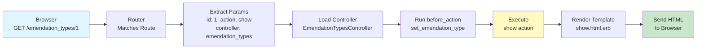
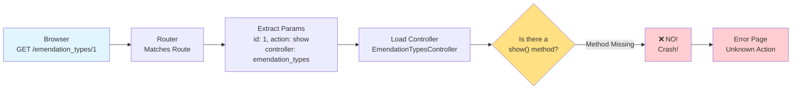
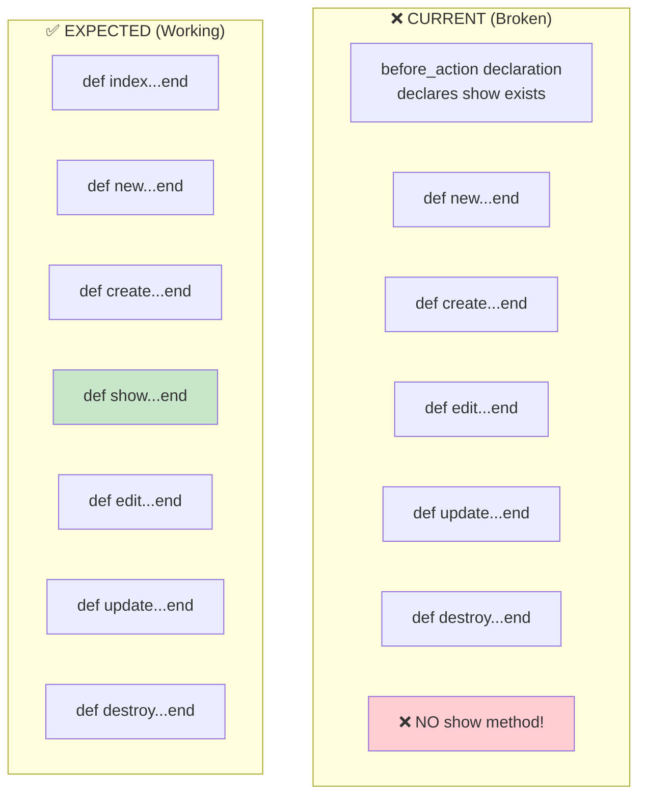
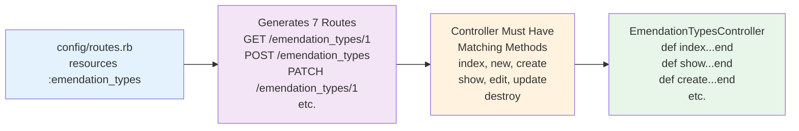
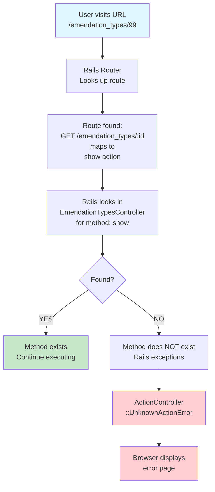
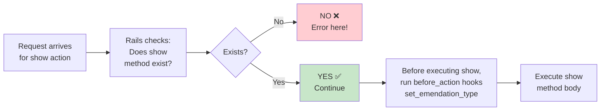

# Rails Action Lifecycle Diagrams

## Diagram 1: Normal (Working) Flow

When a Rails action exists and works correctly:



---

## Diagram 2: Current (Broken) Flow

**This is what's happening in your code:**



---

## Diagram 3: Controller Method Comparison

**What You Have vs. What Rails Expects**



---

## Diagram 4: Routes vs. Actions

**What Creates Routes vs. What Handles Them**



---

## Diagram 5: The Error Chain

**How the error message gets generated**



---

## Diagram 6: Before Action Hook Execution Order

**This explains why before_action doesn't help you**



---

## Diagram 7: Controller Method Structure

**Anatomy of a properly implemented action with before_action**

```
┌─────────────────────────────────────────────────────┐
│ EmendationTypesController                           │
├─────────────────────────────────────────────────────┤
│                                                     │
│  before_action :set_emendation_type,                │
│               only: [:show, :edit, :update, :destroy]
│                     ↑                               │
│              These actions MUST be defined below    │
│                                                     │
│  def index                                          │
│    @emendation_types = EmendationType.all           │
│  end                                                │
│                                                     │
│  def show                    ← REQUIRED!            │
│    # @emendation_type already loaded by before_act │
│  end                                                │
│                                                     │
│  def new                                            │
│    @emendation_type = EmendationType.new            │
│  end                                                │
│                                                     │
│  def create                                         │
│    # ... implementation                             │
│  end                                                │
│                                                     │
│  private                                            │
│                                                     │
│  def set_emendation_type                            │
│    @emendation_type = EmendationType.find(params[:id])
│  end                        ↑ Loads the object      │
│                                                     │
└─────────────────────────────────────────────────────┘
```

